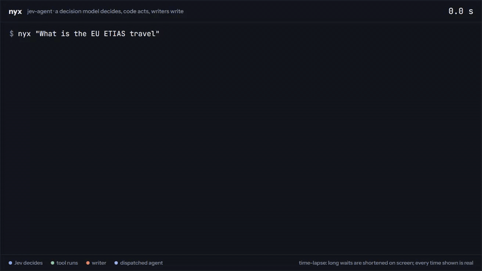
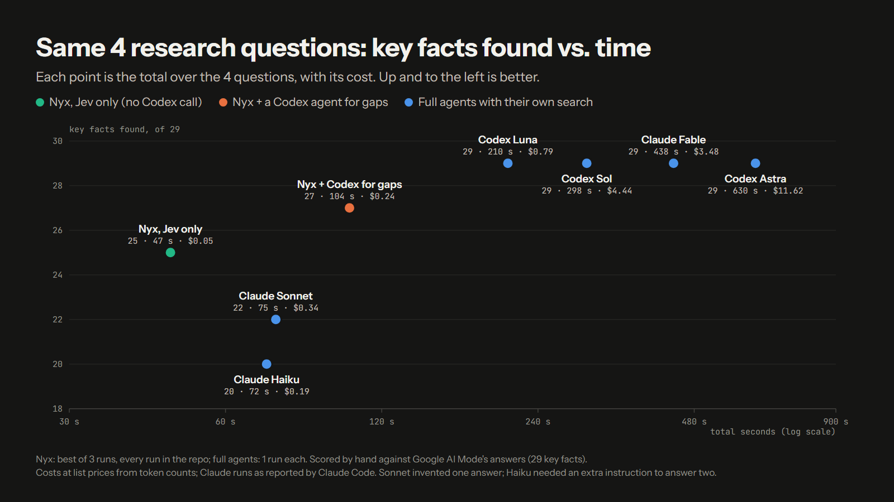
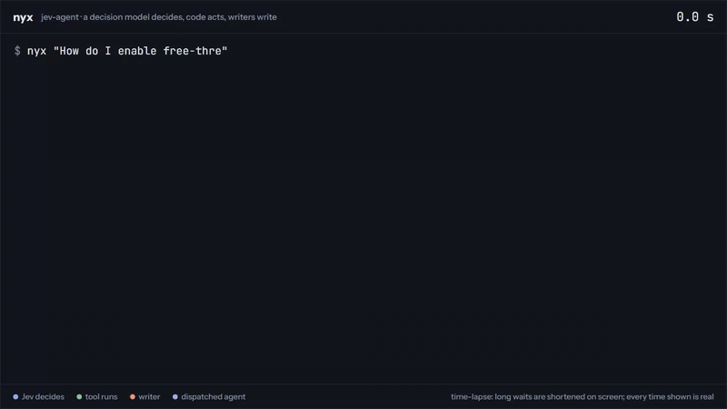

# jev-agent

A personal-assistant backend where a decision model chooses, code acts, and a language model writes only when prose
is the product. The decision model is [TypeSafe](https://typesafe.ai) Jev; the writer is Mercury 2.5 (or a Codex
model); the persona is Nyx, a fictional assistant with a tsundere voice. This is a proof of concept.

## The idea

Most agents let one generative model do everything: decide the next step, call tools, judge whether it is done,
and write the answer. That makes every step slow, costly and hard to audit, and it puts control flow inside a prompt.

jev-agent splits the work:

- **Pneuma (the decision layer, TypeSafe Jev)** answers typed multiple-choice questions with calibrated confidence,
  about 0.6 seconds per round: should the web be searched, does a habit fit, does this reply cover each point the
  user asked, is the request satisfied. It never writes text.
- **Code** turns confident answers into actions, runs tools in parallel, and owns every loop, budget and stop.
- **Psyche (Mercury 2.5, or Codex Luna)** writes replies from the evidence and renders them in Nyx's voice. It runs
  blind: no tools, no web.
- **Nous is the strong side, and its models are whatever the task needs.** When nothing is confident or a checked
  aspect of the answer is still missing, Jev dispatches a full agent (Codex, `DISPATCH_MODEL`, Luna by default) that
  does its own research, writes only inside its own folder under `vault/work/`, and has no timeout; the harder calls
  go to `NOUS_MODEL` (GPT-6 Astra in `.env.example`). Both can be set to any model that suits the work. The harness
  picks up the answer and files; memory and habits stay the harness's.
- **Habits** are learned from accepted runs: a drafted workflow is promoted only after a later run reproduces it,
  then replays with no model choosing steps.

Every decision, with its confidence, lands in a JSONL trace, so each run can be read back step by step. The web is
read through [jev-digest](https://github.com/pr0ta9/jev-digest), which searches, fetches and uses Jev to keep only
the passages that answer the question, with their URLs.

## Results

Nyx run by Jev alone, with Mercury writing and no Codex model at all, got 25 of 29 essential facts in 47 seconds for
five cents. With nous, the Codex agent Jev dispatches for gaps, it got 27 of 29 in 104 seconds for $0.24: half the
time of the fastest agent that got all 29, for under a third of its cost.

| Nyx, Jev only | Nyx with nous | Best full agent |
|---|---|---|
| **25 / 29** · 47 s · $0.05 · no Codex call | **27 / 29** · 104 s · $0.24 · one question dispatched | **29 / 29** · Codex Luna · 210 s · $0.79 |

[](docs/media/nyx-etias.mp4)

Nyx answering the ETIAS question: every decision Jev made, each tool call and the writer, replayed from the run's own
trace. 16.5 s, 7 of 7 essential facts, no agent needed. Click for the full-quality video.

### Standings

Four questions (Python 3.13 free-threading, dietary fibre, the EU's ETIAS, and a Mushoku Tensei plot question), each
scored by hand against the essential facts in Google AI Mode's own answer to the same question. Every agent ran
isolated from local configuration.



Seconds on a log scale. The table below holds the same data.

| Agent | Facts /29 | Seconds | Cost | Search |
|---|---:|---:|---:|---|
| Nyx, Jev only (best of three runs) | 25 | 47 | $0.05 | one digest per question; Mercury writes; no Codex call |
| Nyx with nous (best of three runs) | 27 | 104 | $0.24 | one digest per question; the Python question sent to the Codex agent |
| Codex Luna | 29 | 210 | $0.79 | 8–12 searches per question |
| Codex Sol | 29 | 298 | $4.44 | 6–14 |
| Claude Fable | 29 | 438 | $3.48 | on 2 of 4 questions |
| Codex Astra | 29 | 630 | $11.62 | 6–18 |
| Claude Sonnet | 22 | 75 | $0.34 | once; its Rudeus answer is invented |
| Claude Haiku | 20 | 72 | $0.19 | once; answered the rest from memory |

Both Nyx variants have Jev decide every step and Mercury 2.5 write every reply. "Jev only" never calls a Codex model;
"with nous" adds the expert checklist and dispatches Codex Luna for the gaps Jev confirms, which is the release
default. Fable and Sonnet ran on 2026-09-23; Haiku ran with one added instruction to answer general questions, because
inside Claude Code it otherwise refused two as off-topic. Every run of every configuration is in
[bench/questions.md](bench/questions.md) and in the table below.

<details>
<summary>Every run of every configuration</summary>

| agent | essential facts /29 | seconds, 4 questions | cost |
|---|---:|---:|---:|
| Nyx with nous, run 1 | 27 | 104 | $0.24 |
| Nyx with nous, run 2 | 23 | 90 | about $0.10 |
| Nyx with nous, run 3 (search engines rate-limited on ETIAS; Nyx asked to retry) | 15 | 62 | about $0.05 |
| Nyx, Jev only, run 1 (search engines rate-limited on fibre) | 19 | 55 | $0.03 |
| Nyx, Jev only, run 2 | 25 | 47 | $0.05 |
| Nyx, Jev only, run 3 | 24 | 63 | $0.03 |
| Nyx, dispatch without the checklist, runs 1 to 3 | 23, 22, 22 | 52, 50, 46 | $0.05 each |
| Nyx, Mercury + Sol nous | 24 | 105 | $0.63 |
| Nyx, Mercury + Astra nous | 23 | 176 | $1.68 |

</details>

### Question by question

| Question | Jev only | With nous | What changed |
|---|---:|---:|---|
| Python 3.13 free-threading | 4 / 7 · 11.6 s | 7 / 7 · 65.1 s | The expert checklist found two of its six items unanswered; Jev sent the draft and the gaps to the Codex agent, which filled them in 53 s: the separate `python3.13t` build, C extensions turning the GIL back on, and the "experimental" status. |
| Dietary fibre | 6 / 6 · 10.4 s | 6 / 6 · 12.3 s | Nothing missing either way. |
| EU ETIAS | 7 / 7 · 13.1 s | 7 / 7 · 16.5 s | Nothing missing either way (the replay above). |
| Mushoku Tensei | 8 / 9 · 12.3 s | 7 / 9 · 10.0 s | Not dispatched; the writer dropped one more detail in this run (see below). |
| **Total** | **25 · 47 s** | **27 · 104 s** | The agent added three facts on the one question it saw; the rest is run-to-run variance in what the writer keeps. |

### Why the agent did not bring it to 29

The agent only works on what Jev sends it, and in this run Jev sent it one question. The two facts still missing are
both on Mushoku Tensei: that Rudeus learned of Eris's love only after her death, and that his revenge never reached
Hitogami. Both were in the evidence the writer had; Mercury left them out. Jev's checks then judged the reply
complete: all nine aspects covered, all five checklist items answered, and "could more research help?" answered no
(0.53). So nothing was dispatched, and the gap stayed.

In other words, the checks catch a missing *topic* well (Python's limitations) but not a missing *detail* inside a
topic the reply already covers (what happened to Eris is covered; that he learned of her love afterwards is not).
Asking the checklist for those details, or checking the writer's reply sentence by sentence against the passages it
was given, is the next step toward 29.

### Nyx checks whether its answer is complete

Nyx always verified its draft, but only against what it already had: the aspects of the question and the passages its
web digest returned. That check cannot notice a fact the digest never fetched. On Python, Jev marked "limitations"
covered in every run while two limitations the rubric expects were missing. A Codex agent notices, because it knows
what a complete answer contains, and keeps searching.

Nyx now does the same in its own way: a generator proposes and Jev judges.

| Step | What happens | Time |
|---|---|---:|
| Expert checklist | Mercury lists what a complete, expert answer must settle, as specific questions ("which extensions turn the GIL back on?"). | ~1 s |
| Jev judges | In the same verifying round, Jev marks each item answered, missing or not needed, and asks for the specific answer, not just the topic. | <1 s |
| Gaps go to the agent | Confidently missing items, when Jev says more research could answer them, go to a Codex agent with the draft. It researches on its own, writes only in its work folder, and its answer is checked again. | ~40–55 s |

[](docs/media/nyx-python.mp4)

The Python question: the checklist finds two gaps, Jev dispatches a Codex agent, and the final answer scores 7 of 7.
Long waits are shortened on screen; every time shown is real.

On the Python question the effect is direct: whenever the checklist sent the gaps to the agent, the answer scored
**7 of 7**, against 3 to 5 before. When nothing is missing, as with fibre and ETIAS, the check costs about a second
and nothing leaves Nyx.

### Nous, the dispatched agent

| When | What happens |
|---|---|
| A checked gap more research could answer | The agent gets the draft and the missing points, and returns a complete answer. |
| No confident move in a round | The whole request goes to the agent, once per request. |
| The agent runs | Codex Luna (or the stronger nous model when the output leaves the vault), with its own web search, writing only in `vault/work/<trace id>/`, and no timeout: it returns an answer or an error. |
| It returns | Jev verifies the answer like any draft, Nyx's voice renders it, and the harness records and indexes the files the agent wrote. Memory and habits stay the harness's. |

### What is left

The two facts the best run missed, both on Mushoku Tensei (that Rudeus learned of Eris's love only after her death,
and that his revenge never reached Hitogami), were in the evidence; the writer left them out. Next steps, in the order
I would try them:

1. **Check every shown passage, sentence by sentence.** Details like these sit in passages the current check does not ask about.
2. **Ask Jev before dispatching on a no-move.** On borderline note-saving requests Jev leans the right way but under the confidence bar, so the request goes to the agent; asking "can Nyx's own tools finish this?" first would keep those fast and learnable as habits.
3. **Make the checklist fire more reliably.** On Python it sent the gaps to the agent in half of the runs; in the others Jev judged the checklist answered.

### Method

**Rubric.** Google AI Mode's own answer to each question, pruned to the items that directly answer a sub-question the
user asked: 29 in total (Python 7, fiber 6, ETIAS 7, Mushoku Tensei 9). Paraphrase counts; a fact stated wrongly does not.

**Isolation.** Codex ran with `--ignore-user-config` and Claude Code with local settings only and no MCP servers, each
in an empty directory. Nyx's questions ran with no recent turns and a vault cleared of notes, habits and fixture files,
so no answer saw an earlier one.

**Cost.** List prices from token counts: Jev $0.042 per million input tokens (the only Jev price available), Mercury
$0.04/$0.15, Luna $1/$6, Sol $5/$30, Astra $10/$50 per million; Claude runs as reported by Claude Code. Nyx's cost
includes the Jev calls inside jev-digest and the agent dispatch. Mercury 2.5 is priced at its launch discount; at the
standard $0.20/$0.75, each Nyx run costs under a cent more.

**Runs.** Nyx's figures are its best of three runs with the release default; one run per full agent. Four questions
and one scorer make this a proof of concept, not a benchmark to generalise from.

Source data: [bench/questions.md](bench/questions.md) and [bench/hand-scores.json](bench/hand-scores.json); every Nyx
run's decisions, including each dispatch, are in its trace. The replays are generated from those traces.

### Acceptance

Eight of the eleven acceptance rows pass in every run, including a real dispatch whose files the harness finds in
the agent's folder. The three habit-learning rows fail: on borderline rounds Jev is not confident enough to act, the
request is dispatched, and a dispatched run is never learned as a habit. Before dispatch replaced planning, all eleven
passed. See [docs/STATUS.md](docs/STATUS.md).

## Running it

You need Python 3.11+, Docker, a [TypeSafe](https://typesafe.ai) API key for Jev, an
[Inception Labs](https://www.inceptionlabs.ai) API key for Mercury 2.5, and the [Codex CLI](https://github.com/openai/codex)
logged in (nous is dispatched and habits are drafted through it).

```
git clone https://github.com/pr0ta9/jev-digest
docker compose -f jev-digest/docker/docker-compose.searxng.yml up -d     # SearXNG on port 8089, with autocomplete

git clone https://github.com/pr0ta9/jev-agent && cd jev-agent
python -m venv .venv
.venv/bin/pip install -e .[dev]            # Windows: .venv\Scripts\pip install -e .[dev]
cp .env.example .env                       # fill in TYPESAFE_API_KEY and MERCURY_API_KEY
.venv/bin/nyx "What is the EU ETIAS travel authorization?"
.venv/bin/nyx --accept traces/<trace>.jsonl     # accept a run: drafts or verifies a habit
.venv/bin/python -m pytest                 # 89 tests, no network
```

The first two lines only start the search service; jev-digest itself is installed from GitHub as a dependency.

## What is where

| path | what |
|---|---|
| [docs/DESIGN.md](docs/DESIGN.md) | the specification: glossary, control loop, decision catalog, slot ladder, learning, persona, and the measurement behind every rule |
| [docs/STATUS.md](docs/STATUS.md) | where the proof stands, known issues, open questions |
| `soma/` | the proof: 16 files, about 1,150 lines. `loop.py` is the round; `questions.py` holds every question Jev is asked |
| `prompts/` | the writer, dispatched-agent, expert-checklist, proposer, habit-drafter and voice prompts |
| `bench/` | the acceptance set, baseline runners, hand scores and the Google rubric |
| `tests/` | 89 tests with a fake Jev, fake writers and a fake agent |

## Status

A working proof of concept, not a product. It runs from the command line with a local vault of notes and files.
Known gaps are listed in [docs/STATUS.md](docs/STATUS.md): the digest sometimes shows the writer too little evidence,
writers still drop sub-facts they were given, and public search engines rate-limit heavy use.

## License

MIT. See [LICENSE](LICENSE). The Google AI Mode answers quoted in [bench/reference-google.md](bench/reference-google.md) are Google's text, used only as the scoring rubric, and are not covered by the MIT license.
